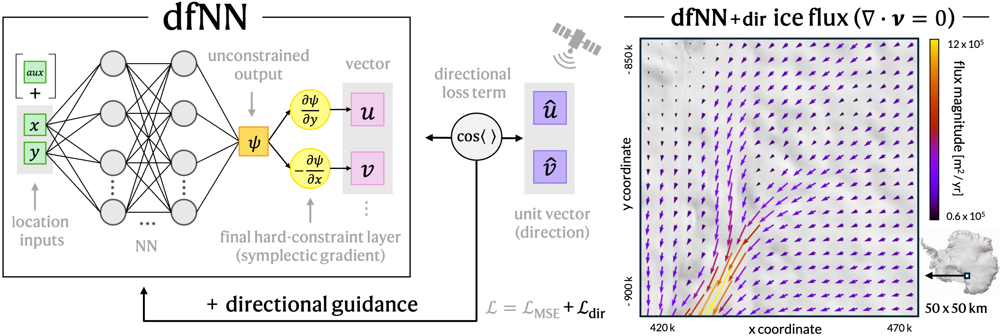

# Mass conservation on rails

Reproducible code for "Mass Conservation on Rails - Rethinking Physics-Informed Learning of Ice Flow Vector Fields" submission. We propose dfNNs (divergence-free neural networks) to reconstruct divergence-free (i.e. locally mass conserving) vector fields in 2D and compare them to PINNs and NNs on real ice flux data from Antarctica's Byrd glacier. 

## Models
- dfNN
- PINN
- NN

### Ablation variants

For all three models, we evaluate the following three variants, resulting in 9 models total.

- (base)
- dir (directional guidance)
- aux (auxiliary surface inputs, i.e. surface elevation)

## Set up the environment

Follow these steps to set up the environment for reproducing our experimental results.

Create a new environment named `dfnn_env` with Python 3.10: 

`conda create -n dfnn_env python=3.10`

Follow the prompts to complete creation. Then activate the environment with:

`conda activate dfnn_env`

To install the CUDA-enabled version of PyTorch, use the appropriate build for your system. Our experiments were run using a GPU with CUDA 12.1, so we install:

`pip install torch==2.5.1 torchvision torchaudio --index-url https://download.pytorch.org/whl/cu121`

Next, use `pip` to install all required packages from the `requirements.txt` file, as well as their dependencies.

`pip install -r mass_conservation_on_rails/requirements.txt`

Installation may take a few minutes.

## Run experiments

All 9 experiments can be run via the terminal with `python mass_conservation_on_rails/run_dfNN_aux.py` and equivalent.
