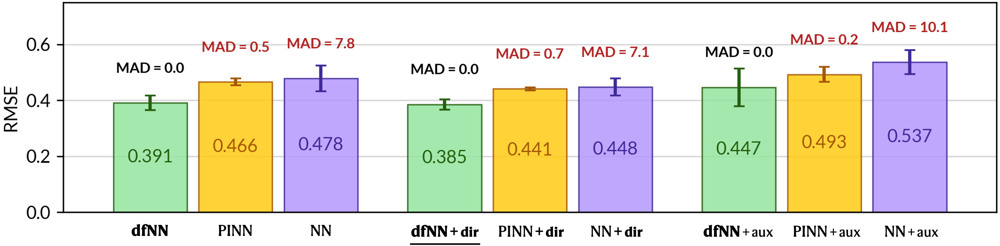
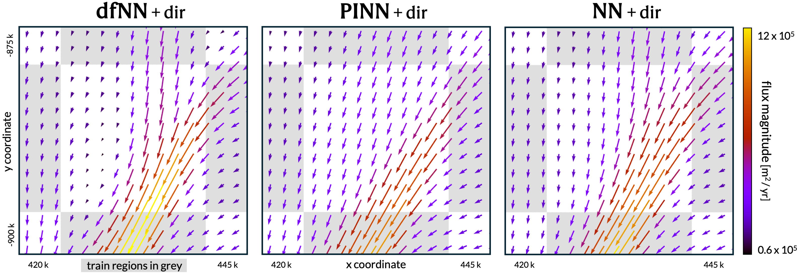

# Mass conservation on rails

Reproducible code for **Mass Conservation on Rails - Rethinking Physics-Informed Learning of Ice Flow Vector Fields** submission. We propose dfNNs (divergence-free neural networks, for implementation see 
[models.py](models.py)) to reconstruct divergence-free (i.e. locally mass conserving) vector fields in 2D and compare them to PINNs and NNs on real ice flux data from Antarctica's Byrd glacier. Generating physically consistent ice flux interpolation from *noisy & sparse* data - without flux artefacts - is crucial for numerical ice sheet models to work, and to reliably project future sea level rise from Antarctic ice sheet contributions (see [this paper](https://agupubs.onlinelibrary.wiley.com/doi/10.1029/2011GL047338) for example).

## Models
- dfNN
- PINN
- NN

### Ablation variants

For all three models, we evaluate the following three variants, resulting in 9 models total.

- (base)
- dir (directional guidance)
- aux (auxiliary surface inputs, i.e. surface elevation)

## Set up the environment

Follow these steps to set up the environment for reproducing our experimental results.

Create a new environment named `dfnn_env` with Python 3.10: 

`conda create -n dfnn_env python=3.10`

Follow the prompts to complete creation. Then activate the environment with:

`conda activate dfnn_env`

To install the CUDA-enabled version of PyTorch, use the appropriate build for your system. Our experiments were run using a GPU with CUDA 12.1, so we install:

`pip install torch==2.5.1 torchvision torchaudio --index-url https://download.pytorch.org/whl/cu121`

Next, use `pip` to install all required packages from the `requirements.txt` file, as well as their dependencies.

`pip install -r mass_conservation_on_rails/requirements.txt`

Installation may take a few minutes.

## Run experiments

After the python environment is activated, all 9 experiments can be run via the terminal with `python mass_conservation_on_rails/run_dfNN_aux.py` and equivalent. This will save the trained models to [trained_models](trained_models) and save results to [results](results). After all experiments are run you can use the jupyter notebook [visualise_results_and_convergences.ipynb](results/visualise_results_and_convergences.ipynb) to plot model convergence and view performance metrics on test.

The following results can be reproduced:

The models produce the following predictions over a small, selected test region:

## Data

Here we provide the already preprocessed training, testing and *directional guidance* data in [data](data). After the reviewing process we will link to the full reproducible preprocessing pipeline (not anonoymous). We use the following data sets:
- [Ice thickness measurements from the Bedmap data collection (Bedmap 1 + Bedmap 2 + Bedmap 3)](https://www.bas.ac.uk/project/bedmap/#data)
    - *Frémand, Alice C., et al. "Antarctic Bedmap data: Findable, Accessible, Interoperable, and Reusable (FAIR) sharing of 60 years of ice bed, surface, and thickness data." Earth System Science Data 15.7 (2023): 2695-2710.*
- [Ice velocity map from MEaSUREs Phase-Based Antarctica Ice Velocity Map, Version 1](https://nsidc.org/data/nsidc-0754/versions/1)
  - *Mouginot, J., Rignot, E. & Scheuchl, B. (2019). MEaSUREs Phase-Based Antarctica Ice Velocity Map. (NSIDC-0754, Version 1). Boulder, Colorado USA. NASA National Snow and Ice Data Center Distributed Active Archive Center. https://doi.org/10.5067/PZ3NJ5RXRH10. Date Accessed 08-22-2025.*

